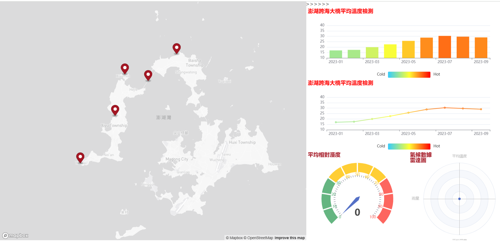

## 澎湖數據視覺化  
# 澎湖旅遊與天氣數據分析專案

本專案針對澎湖地區的旅遊人數與天氣數據進行動態視覺化分析。  
透過整合地圖與圖表，使用者能快速了解澎湖各區的人口數據、溫度趨勢及濕度狀況。點擊地圖上的地標標記，即可觸發對應的圖表更新，展示詳細的數據分析結果。

---

---

## 功能特點

- **互動式地圖整合**  
  基於 Mapbox 實現澎湖地區地圖標記互動，提供直觀的地理空間數據展示。
  
- **多維數據圖表**  
  使用 ECharts 繪製直方圖與折線圖，展示澎湖旅遊人數、溫度趨勢等關鍵資訊。

- **即時數據更新**  
  點擊地圖座標，圖表動態更新顯示該地區的詳細歷史數據與趨勢分析。

---

## 使用技術

<table style="width:100%; text-align:center;">
  <tr>
    <th style="text-align:center;">技術</th>
    <th style="text-align:center;">說明</th>
  </tr>
  <tr>
    <td>Mapbox GL</td>
    <td>用於澎湖地圖可視化與互動</td>
  </tr>
  <tr>
    <td>ECharts</td>
    <td>用於直方圖與折線圖的數據展示</td>
  </tr>
  <tr>
    <td>jQuery</td>
    <td>實現數據的 AJAX 請求與 DOM 操作</td>
  </tr>
  <tr>
    <td>HTML/CSS</td>
    <td>前端界面設計</td>
  </tr>
  <tr>
    <td>JavaScript</td>
    <td>實現交互邏輯與動態渲染</td>
  </tr>
</table>

---

## 線上預覽

您可以直接透過以下連結體驗專案：  
[澎湖數據視覺化專案](https://zhenyan1214.github.io/ClassWork/)

---
